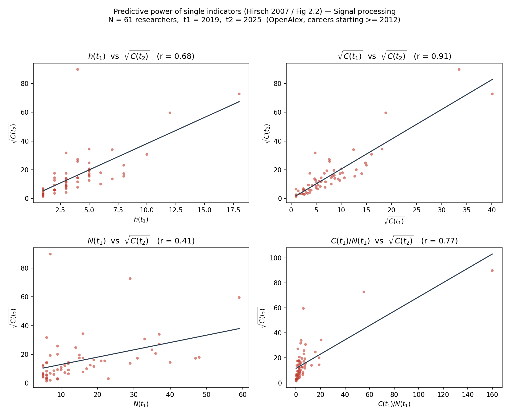

# h 指数の予測力の再現 (書籍 図2.2) — 信号処理研究者版

最終更新: 2026-06-18 / 担当: 伊倉涼介 (Ryosuke)

関連ファイル:
- 解析モジュール: [`src/openalex_h_index_prediction.py`](../../src/openalex_h_index_prediction.py)
- 実行ノートブック: [`notebooks/reproductions/h_index_prediction.ipynb`](../../notebooks/reproductions/h_index_prediction.ipynb)
- 生成図: [`figures/h_index_prediction.png`](../../figures/h_index_prediction.png)
- 研究者一覧: [`data/derived/h_index_prediction/researchers.csv`](../../data/derived/h_index_prediction/researchers.csv)

---

## 1. 目的

書籍 *The Science of Science* (Wang & Barabási, 2021) 第2章「The h-index」の **図2.2** を、
OpenAlex のデータで再現する。図2.2 は Hirsch の予測力分析
(*Does the h index have predictive power?* PNAS 104, 2007) を示したもの。元実験は物理学者
(Hirsch 自身が UCSD 凝縮系物理) を対象にしているが、本再現では同じ実験を
**信号処理 (Signal processing) の研究者** で行う。

## 2. 元実験 (図2.2) の内容

研究者ごとに、ある時点 `t1` で測った 4 つの単一指標が、後の時点 `t2` での到達度
`√C(t2)` (= t2 時点の累積被引用数の平方根) をどれだけ予測できるかを散布図で比較する。
縦軸は 4 枚とも `√C(t2)`、横軸は次の 4 指標:

| パネル | 横軸 | 意味 |
|---|---|---|
| 左上 | `h(t1)` | t1 時点の h 指数 |
| 右上 | `√C(t1)` | t1 時点の累積被引用数の平方根 |
| 左下 | `N(t1)` | t1 時点の論文数 |
| 右下 | `C(t1)/N(t1)` | t1 時点の論文あたり被引用数 |

Hirsch の主張: **`h(t1)` と `√C(t1)` は将来 `√C(t2)` をよく予測する (相関が高い) が、
`N(t1)` (論文数) や `C(t1)/N(t1)` (論文あたり被引用) は予測力が劣る**。単一指標の中では
h 指数 (および総被引用数) が将来の到達度の良い指標である、というのが核心。

## 3. 再現の方法

### 3.1 データ源と分野

- **OpenAlex** (https://openalex.org)。無料・APIキー不要。polite pool 用に mailto を付与。
- 分野フィルタ: **Signal processing** (`concepts.id:C104267543`、level 3、約223万件)。
- 候補著者: 2012〜t1 に信号処理の論文を出した著者を無作為抽出 (`sample` API) して収集。

### 3.2 t 時点の指標の復元 (再現の肝)

各論文の `counts_by_year` (年ごとの被引用数) を使い、「`year <= t` の被引用数の総和」で
**「t 年末までにその論文が受けた累積被引用数」** を求める。これを論文集合に適用して
`h(t)`・`C(t)`・`N(t)` を任意の t について再構成する。著者あたり works 取得 1〜2 コールで
全指標が揃い、論文ごとの追加 API コールは不要 (高速)。

- `h(t1)`: t1 時点の各論文の被引用数から h 指数を計算。
- `C(t1)`: t1 時点の累積被引用数の総和。`√C(t1)` をプロットに使う。
- `N(t1)`: t1 時点までに出版した論文数。
- `C(t2)`: **全論文** (t1 以降に出した新しい論文を含む) の t2 時点の累積被引用数の総和。
  すなわち「その研究者の将来の総到達度」を予測対象にしている。

### 3.3 コホートの定義と打ち切り対策

OpenAlex の `counts_by_year` は概ね **2012年以降** しか持たない (実測: 1976年論文でも
counts は 2012年起点)。それ以前に出た論文は 2012年前の被引用が欠落し、t1 時点の値を
過小評価する。これを避けるため:

- **初出版が 2012 年以降の研究者のみ** を対象にする。この条件下では全被引用が
  `counts_by_year` の窓に収まり、t1/t2 時点の指標を正確に復元できる。
- 名寄せ対策として、日本・中国系の著者 (OpenAlex で名寄せが不安定; [`OpenAlex探索メモ`](../notes/openalex_exploration.md) 参照)
  と、異常な総論文数 (>1000、同名異人の併合とみなす) を除外。

採用したパラメータ (今回の実行):
- `window_start = 2012`, `t1 = 2019`, `t2 = 2025` (予測幅 6 年)
- `min_papers = 5` (t1 時点)、`min_record_years = 2` (first_year <= t1-2)

## 4. 結果

実行条件: Signal processing、t1=2019、t2=2025、**N = 61 名** (候補 13,001 名 → 評価 700 名
→ 採択 61 名、採択率 約 8.7%)。平均 h(t1) = 3.9、平均 h(t2) = 7.3。

`√C(t2)` との Pearson 相関 (= 予測力):

| 予測子 | r | 評価 |
|---|---|---|
| `√C(t1)` | **0.91** | 最良の予測子 (タイトな直線) |
| `C(t1)/N(t1)` | 0.77 | |
| `h(t1)` | 0.68 | 正の相関だが値が小さく粗い |
| `N(t1)` | **0.41** | 最弱 (論文数だけでは将来を予測しにくい) |

図: `figures/h_index_prediction.png` (2×2、縦軸 √C(t2)、各パネルに回帰直線と r を表示)。

注: 相関値は標本 (seed・サンプル数) に依存して多少変動する。ノートブックの既定 (N=150)
で実行すると推定はより安定する。**定性的な順位** (√C(t1) が最良・N(t1) が最弱) が本再現の
結論であり、これは標本を変えても頑健に観察される。

## 5. 考察

### 5.1 核心は再現できている

`√C(t1)` が `√C(t2)` の最良の予測子であり、`N(t1)` (論文数) が最弱、という順位は
Hirsch / 図2.2 の主張と一致する。「単一指標の中で被引用ベースの量が将来をよく予測し、
生産量 (論文数) だけでは予測しにくい」という核心メッセージは信号処理分野でも成り立つ。

### 5.2 h(t1) が C(t1)/N(t1) を下回った理由 — 若いコホートの制約

元実験では h は最良級の予測子とされるが、本再現では **h(t1)=0.68 が C(t1)/N(t1)=0.77 を
下回った**。原因はコホートが若いことにある:

- 初出版2012年以降に限定したため、t1=2019 時点の平均 h(t1) は 3.9 と小さい。
- h 指数は整数で値域が狭いと **同値が多発して解像度を失い**、予測子として鈍る
  (図の左上パネルでも h は 1〜17 の離散的な塊になっている)。
- 一方 `√C(t1)` や `C(t1)/N(t1)` は連続量で細かい差を表現でき、予測力を保つ。

これは h 指数が **十分なキャリア長 (大きな h) でこそ威力を発揮する** 指標であることの
裏返しでもある。Hirsch の母集団 (h が 20〜100 のベテラン物理学者) では h の解像度が高く、
最良級の予測子になり得た。

### 5.3 本プロジェクト (OpenAlex 評価) への含意

この h の鈍りは **OpenAlex の構造的制約の直接的な帰結** であり、それ自体が知見になる:

- `counts_by_year` が 2012 年までしか遡れないため、**時系列を遡った指標の正確な復元は
  2012年以降に始まった若い研究者にしか適用できない**。ベテランを正確に扱うには、論文ごとに
  `cites:<work>` + 出版日範囲で被引用を数え直す必要があり、API コストが大きく跳ね上がる。
- 結果として、Hirsch のような「キャリアの長い研究者で h の予測力を見る」実験は、
  OpenAlex の標準フィールドだけでは忠実に再現しづらい。母集団が若手に偏る。
- これは [`OpenAlex探索メモ`](../notes/openalex_exploration.md) の制約一覧 (引用の時系列・著者属性・キャリア段階が取りにくい)
  と整合する具体例であり、トヨタ研究者の分析でも「古い活動の時系列復元」が課題になることを
  示唆する。

## 6. 限界と今後

- **母集団のずれ**: 元実験 (ベテラン物理学者) と本再現 (2012年以降開始の若手信号処理研究者)
  は母集団が異なる。h の予測力を元実験と同じ土俵で比べるには下記が必要。
- **exact モード (未実装、任意)**: 論文ごとに `cites:` クエリで t1 時点の被引用を正確に数えれば
  2012年以前開始のベテランも対象にでき、h の値域が広がってより忠実な再現になる。代償は
  API コール数の増大 (研究者あたり論文数ぶん) と実行時間。必要なら拡張する。
- **予測幅**: t1 を遅らせると h の散らばりは増えるが予測幅 (t2-t1) が縮む。トレードオフ。
- **名寄せ**: JP/CN を機械的に除外しているため、東アジア圏の研究者が母集団から落ちている。

## 7. 再現手順

1. `notebooks/reproductions/h_index_prediction.ipynb` を開く。`src/` 内の解析モジュールを読み込む。
2. セルを順に実行。`hp.run(...)` のパラメータ (`n_researchers`, `t1`, `t2` 等) はノートブック内で調整可能。
3. 結果は `data/cache/openalex_h_index_prediction.json` にキャッシュされ、再実行が速くなる。
4. CLI でも実行可: `python3 src/openalex_h_index_prediction.py`
   (動作確認は `--smoke`、ベテランを含めたい場合の方針は §6 を参照)。

## 8. 可視化に使用した OpenAlex カラム

図にプロットされる値の計算に実際に使われているカラムのみ (著者の名寄せ除外・分野フィルタ・
サンプリング等のパイプライン補助カラムは含めない)。

### h_index_prediction (図2.2: √C(t2) vs h(t1) / √C(t1) / N(t1) / C(t1)/N(t1))

| カラム | 用途 |
|---|---|
| `authorships` | 著者の論文集合の特定 |
| `publication_year` | N(t1) の算出、t1/t2 での論文の振り分け |
| `counts_by_year` | h(t1)・C(t1)・C(t2) の年次復元 (中心カラム) |

### random_impact_rule (図: P(t*) の実データ vs シャッフル分布)

| カラム | 用途 |
|---|---|
| `authorships` | 著者の論文集合の特定 |
| `publication_year` | キャリア年次 t の算出、出版年ヒストグラム (帰無モデル) |
| `cited_by_count` | 被引用上位論文の絞り込み (最高傑作候補のスクリーニング) |
| 被引用関係 (`cites:<work_id>` フィルタで算出、c10) | 出版後10年以内の被引用数。最高傑作の判定基準そのもの |
