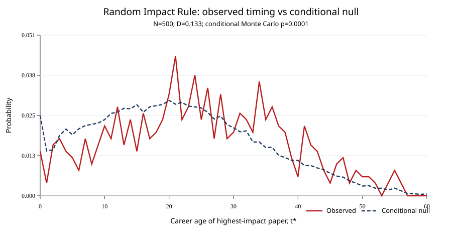

# Random Impact Rule の外的再現: OpenAlex固定スナップショット

分析実行日: 2026-07-16  
対象論文: Sinatra, R., Wang, D., Deville, P., Song, C., & Barabási, A.-L. (2016). *Quantifying the evolution of individual scientific impact*. **Science**, 354, aaf5239. [DOI](https://doi.org/10.1126/science.aaf5239)

関連成果物:

- [実行済みノートブック](../../notebooks/reproductions/random_impact_rule_external.ipynb)
- [研究者別の処理済みデータ](../../data/derived/random_impact_rule/records.csv)
- [観測分布・帰無分布](../../data/derived/random_impact_rule/distribution.csv)
- [実行メタデータとハッシュ](../../data/derived/random_impact_rule/summary.json)
- [図](../../figures/random_impact_rule_external.svg)

## 結論

この固定OpenAlex標本では、Sinatra et al. の Random Impact Rule は支持されなかった。各研究者の実際の年別出版量を保った条件付き帰無モデルと比べると、最高インパクト論文は平均で **3.60年後ろ** に位置し、累積分布の差はモンテカルロ帰無分布から大きく外れた（$D=0.133$、$p_{MC}=0.00010$、10,000反復）。

これは元論文を反証する結果ではない。本分析は、データ源、著者同定、母集団、インパクト指標、論文順序の扱いが元論文と異なる**外的再現**である。再現が成立しなかったこと自体が、Science of Science の結論をデータベース・名寄せ・サンプル設計から独立した普遍則として扱えないことを示す。



## 1. 元論文で検証された命題

Sinatra et al. は、研究者のキャリア内で最も高いインパクトを持つ論文が、論文列のどの位置にも等確率で現れると報告した。この命題を Random Impact Rule と呼ぶ。元論文では、物理学者2,887名を含む複数分野のキャリアを分析し、インパクトを出版後10年の被引用数で測った。結論は「高インパクト論文は初期・中期・後期のどこにも現れ得る」であり、単に経験を積めば最高傑作が後半に来るという仮説ではない。

本再現では、Q パラメータの推定や賞の予測は行わない。中心命題である「最高インパクト論文のタイミング」を検査対象に限定する。

## 2. 入力データとサンプル

### 2.1 固定入力

既存の `data/cache/openalex_random_impact_rule.json` を用いた。これは2026-06-13保存のOpenAlex API応答であり、SHA-256は `48e6476e5cb2e0f5e7587422f59367bac3ee91dc03f6ec39ff3ff64f491a0628` である。ライブAPIを再照会しないため、後日の引用数更新やAPI仕様変更の影響を受けずに本結果を再実行できる。

OpenAlexのデータモデルと現行APIの利用条件は、[API Overview](https://developers.openalex.org/api-reference/introduction)、[Authentication & Pricing](https://developers.openalex.org/guides/authentication) を参照。なお、このキャッシュは旧 `Concepts` フィルタを使用しており、現行の新規収集では非推奨のため `Topics` へ移行する必要がある。

### 2.2 抽出条件

| 条件 | 設定 |
|---|---|
| 候補の起点 | `concepts.id:C121332964` を含む記事からの著者抽出 |
| 候補抽出用の論文数 | 50,000件 |
| 評価した候補 | 1,074名 |
| 採用した研究者 | 500名 |
| 文献種別 | `article` |
| 適格論文の最終出版年 | 2015年 |
| キャリア長 | 20年以上60年以下 |
| 適格論文数 | 10本以上 |
| 最高インパクト候補 | 総被引用数上位20本 |
| 乱数 | 元処理の選定は42、検定は20260716 |

この母集団を「物理学者」と断定してはならない。物理学トピックを持つ論文から著者を抽出しただけであり、研究者の他の論文は他分野を含み得る。以後、この標本を **physics-seeded OpenAlex sample** と呼ぶ。

既存キャッシュを作ったパイプラインには、名寄せ問題への暫定対応として地域・氏名表記に関する除外規則が含まれる。この規則は結果の一般化を阻害し、公平な本分析の方法にはならない。今回の目的は既存入力の再計算なので保持したが、次の再収集では削除し、不確実性フラグと手動監査で置き換える。

## 3. 指標と検定

### 3.1 最高インパクト論文

既存キャッシュでは、各候補論文について OpenAlex の `cites:<work>` 照会と引用元の出版日で被引用を数え、最も大きい値を最高インパクト論文としている。変数名は `c10` だが、実装上は出版年から出版年+10までを含む暦年窓である。通常の「出版後10年間」とは端点の定義が完全には一致しないため、ここでは **c10代理指標** と呼ぶ。

また、全適格論文のc10を求めず、総被引用数上位20本に候補を制限している。遅れて引用される論文が上位20本外にある場合、真の最大c10を逃す可能性がある。この近似はAPIコールを減らす利点があるが、元論文と同じ測定ではない。

### 3.2 条件付き帰無分布

研究者 $i$ のキャリア年齢 $t$ における適格論文数を $n_i(t)$、適格論文総数を $N_i$、研究者数を $M$ とする。Random Impact Rule の下では、その研究者の各論文が最高インパクト論文になる確率は $1/N_i$ である。したがって、個人の出版量とキャリア長を保った集団帰無分布は次である。

$$P_0(t)=\frac{1}{M}\sum_{i=1}^{M}\frac{n_i(t)}{N_i}$$

観測分布 $P_{obs}(t)$ と $P_0(t)$ の累積差の最大値を $D$ とした。さらに、各研究者について年別出版数を重みとして最高論文の位置を1回抽選する操作を10,000回繰り返し、$D$ の条件付きモンテカルロ帰無分布を作った。これにより、初期に多く出版する研究者、後期に多く出版する研究者、短い・長いキャリアの構成を保持したまま検定する。

## 4. 結果

| 指標 | 値 |
|---|---:|
| 研究者数 | 500 |
| 観測された平均 $t^*$ | 24.884年 |
| 条件付き帰無での平均 $t^*$ | 21.280年 |
| 差（観測 − 帰無） | **+3.604年** |
| $P_{obs}(t)$ と $P_0(t)$ のPearson相関 | 0.753 |
| 累積分布差 $D$ | **0.1331** |
| 帰無下の平均 $D$ | 0.0305 |
| 帰無下の95パーセンタイル | 0.0480 |
| 帰無下の99パーセンタイル | 0.0572 |
| 条件付きモンテカルロ $p$ 値 | **0.00010** |

最大の累積差はキャリア19年目で生じた。この時点までに観測された最高インパクト論文の累積割合は、条件付き帰無より13.3ポイント低い。すなわち、この標本では早い段階の最高論文が少なく、最高インパクト論文が後半に寄る傾向が見られる。

既存実装が500回シャッフルで出力した記述統計は `KS=0.1326`、`Pearson r=0.7512` であり、今回の解析的帰無分布による `D=0.1331`、`r=0.7527` と整合する。相関が0.75であることだけではランダム配置を支持できない。条件付き帰無下での典型的な$D$が0.03程度であるため、0.133の差は大きい。

## 5. 解釈

本標本に限れば、「研究者内で論文の位置をランダムに選ぶ」モデルでは、最高インパクト論文の時期を説明できない。後半への偏りには、少なくとも次の二種類の説明があり得る。

1. 実際のキャリア過程として、経験、ネットワーク、資源、テーマ選択などが後半の高インパクトに関係する。
2. データ・測定・サンプル設計が後半への見かけの偏りを作っている。

この結果だけでは両者を区別できない。特に今回のデータ設計には後者の要因が多いため、「Random Impact Rule は誤り」と結論づけてはならない。一方で、「既存研究の定性的図と相関が似ているから再現成功」と評価することも誤りである。条件付き帰無検定を追加したことで、この標本では不一致が明確になった。

## 6. 元論文との主な差と限界

| 論点 | 元論文 | 本再現 | 影響 |
|---|---|---|---|
| データ源 | 物理学データとWoSを含む複数分野データ | OpenAlex APIキャッシュ | 収録範囲・引用リンク・更新の定義が異なる |
| 著者母集団 | 分野別に再構成したキャリア | トピックを含む論文から抽出 | 分野の純度と名寄せ誤差が異なる |
| インパクト | 論文の長期引用指標 | `c10`代理指標、暦年端点を含む | 時間窓が完全に一致しない |
| 最大論文の探索 | 元研究の定義に従う | 総被引用上位20本のみ | 真の最高c10を見落とす可能性 |
| 位置 | 論文列内の位置 | 年別集計からのキャリア年齢 | 同一年内の順序を失う |
| 右側打ち切り | 元データの設計に従う | 2015年までに制限 | 時代・出版慣行が選別される |
| 名寄せ | 元論文の手順 | OpenAlexの自動名寄せと既存の暫定除外 | 偽の統合・分割、代表性の歪み |

さらに、OpenAlexでは過去の引用リンクと著者レコードも更新され得る。再現可能性のためにキャッシュを固定した一方、これは現在のOpenAlexの真値を主張するものではない。公開書誌データの名寄せ・参照リンクの品質が基盤・年・分野により変わることは、[OpenAlexとWoS/Scopusの参照被覆比較](https://doi.org/10.1007/s11192-025-05293-3) でも示されている。

## 7. 次の再現実験への提案

1. **著者母集団を先に固定する。** ORCID、CV、大学・企業の公式ページで確認した研究者を用い、候補・確定・不明を分ける。
2. **地域・文字種による除外を廃止する。** 名寄せの不確実性は除外ではなく`match_status`と感度分析で扱う。
3. **現行OpenAlex APIに移行する。** 無料API keyを環境変数から渡し、旧ConceptではなくTopicsで分野を定義する。全量なら固定スナップショットを利用する。
4. **全適格論文について同一の10年窓を計算する。** 最高20件という近似を外し、出版後10年の端点を事前に定義する。
5. **論文順で検定する。** 同一年の論文を月日、DOI登録日、または同順位のランダム化で処理し、$i^*/N$ の一様性を直接評価する。
6. **分野・時代・キャリア長を層別化する。** 全体平均だけでなく、若手/中堅/長期キャリア、年代、共同研究規模別に結果を示す。
7. **契約がある場合はWoSで感度分析する。** 同一DOI集合に限定し、OpenAlexとWoSの引用・収録差を記録する。ただし数値を混ぜない。

## 8. 実行方法

リポジトリ直下で次を実行する。

```bash
jupyter nbconvert --to notebook --execute --inplace \
  notebooks/reproductions/random_impact_rule_external.ipynb \
  --ExecutePreprocessor.timeout=180
```

ノートブックはネットワーク要求を拒否する `OfflineClient` を使う。必要な既存ファイルは `data/cache/openalex_random_impact_rule.json` と `src/openalex_random_impact_rule.py` である。生成される成果物は `data/derived/random_impact_rule/` と `figures/` に保存される。固定入力のハッシュ、パラメータ、出力CSVのハッシュは `summary.json` に記録される。
